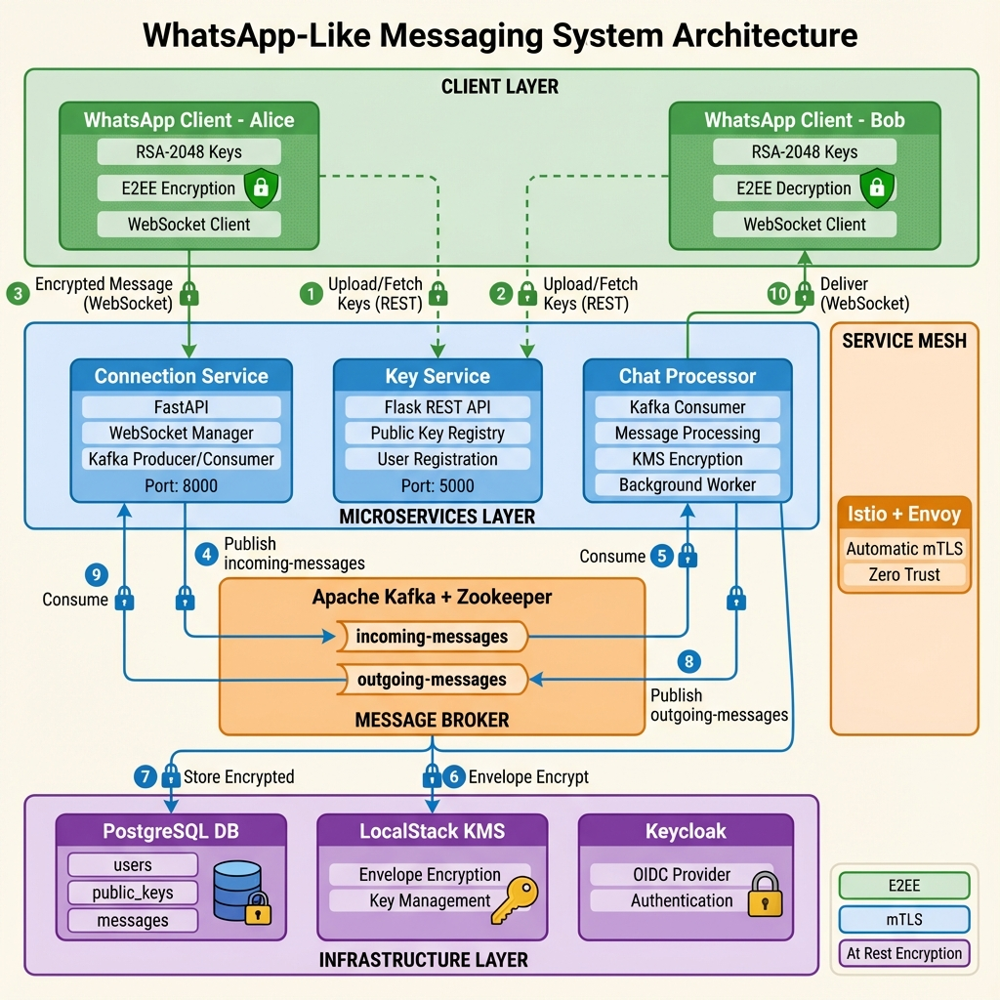

# WhatsApp Simulator - End-to-End Encrypted Messaging

A distributed messaging system demonstrating **End-to-End Encryption (E2EE)**, **Envelope Encryption**, and **Zero-Trust Architecture** using modern cloud-native technologies.

This project implements a WhatsApp-like messaging platform with:
- **End-to-End Encryption**: RSA + AES hybrid encryption (similar to Signal Protocol)
- **Microservices Architecture**: Three specialized services handling connections, messages, and key management
- **Event-Driven Design**: Kafka-based asynchronous message processing
- **Zero-Trust Security**: Istio service mesh with automatic mTLS between all services
- **Envelope Encryption**: AWS KMS integration for encryption at rest
- **Identity Management**: Keycloak OIDC authentication
- **Modern Web UI**: React frontend with WhatsApp-style chat interface

## 🚀 Quick Start (Frontend)

Want to see the messaging in action? Try the web interface:

```bash
# 1. Build and load images (if not done already)
docker build --no-cache -t key-service:latest ./services/key-service
docker build --no-cache -t connection-service:latest ./services/connection-service
minikube image load key-service:latest
minikube image load connection-service:latest

# 2. Deploy services
kubectl apply -f k8s/
kubectl apply -f k8s/db-init-job.yaml

# 3. Start backend port-forwards (in separate terminals)
# Note: Port 5001 (not 5000) due to macOS AirPlay conflict
kubectl port-forward svc/key-service 5001:5000 -n cloud-demo
kubectl port-forward svc/connection-service 8000:8000 -n cloud-demo

# 4. Run the frontend
cd frontend
npm install  # First time only
npm run dev
```

Then open **http://localhost:5173** to see Alice and Bob chatting with end-to-end encryption!

For detailed frontend documentation, see [frontend/README.md](frontend/README.md)

## Frontend Features

### Two-Stage Flow Visualization
The frontend provides an interactive visualization of the complete message flow:

- **Stage 1: JWT Acquisition** - Shows Keycloak issuing JWT tokens to Alice and Bob with animated token flow
- **Stage 2: Message Flow** - Real-time visualization of encrypted message routing through all services

### Flow Visualization Phases
- **Phase 0: Infrastructure Setup** - Shows all Kubernetes services and their interdependencies
- **Phase 1: Message Flow** - Detailed step-by-step encryption and routing visualization
- **Phase 2: mTLS** - Service mesh and mutual TLS visualization
- **Phase 3: Envelope Encryption** - KMS encryption at rest visualization
- **Phase 4: Keycloak** - OIDC authentication and JWT token flow

### Real-time E2EE Encryption
- In-browser RSA-2048 + AES-256 encryption using Web Crypto API
- Ephemeral AES session keys for each message
- Public key exchange via Key Service
- Only the recipient can decrypt messages

## Architecture



The diagram above shows the complete system architecture with:
- **Client Layer**: End-to-end encrypted messaging clients (Alice & Bob)
- **Microservices Layer**: Three specialized services for connections, key management, and message processing
- **Message Broker**: Kafka for asynchronous event-driven communication
- **Infrastructure Layer**: PostgreSQL, LocalStack KMS, and Keycloak for data persistence, encryption, and authentication
- **Service Mesh**: Istio + Envoy providing automatic mTLS between all services

## Security Architecture

### 1. End-to-End Encryption (E2EE)
Messages are encrypted on the client side and can only be decrypted by the intended recipient:

- **Key Exchange**: RSA-2048 public keys distributed via Key Service
- **Message Encryption**: 
  - Generate ephemeral AES-256 session key
  - Encrypt message with AES-CBC
  - Encrypt AES key with recipient's RSA public key (OAEP padding)
  - Only recipient's private key can decrypt the session key

### 2. Envelope Encryption (At Rest)
Messages are double-encrypted before storage:

- **Client Layer**: E2EE encryption (only Bob can decrypt)
- **Server Layer**: KMS envelope encryption (protects against database breaches)
- Even if database is compromised, messages remain encrypted under KMS master key

### 3. Transport Security (In Transit)
- **Client ↔ Server**: WebSocket over TLS (can be upgraded to WSS)
- **Service ↔ Service**: Automatic mTLS via Istio/Envoy sidecars
- All inter-service communication is encrypted and authenticated

## Components

### Microservices

#### 1. **Connection Service** (FastAPI + WebSocket)
- Manages persistent WebSocket connections for real-time messaging
- Routes incoming messages to Kafka (`incoming-messages` topic)
- Delivers outgoing messages from Kafka to connected clients
- **Port**: 8000

#### 2. **Key Service** (Flask)
- Public key registry for all users
- Provides key discovery endpoint
- Auto-registers users on first key upload
- **Port**: 5000
- **Endpoints**:
  - `POST /keys` - Upload public key
  - `GET /keys/<user_id>` - Retrieve public key

#### 3. **Chat Processor** (Background Worker)
- Consumes messages from `incoming-messages` Kafka topic
- Applies KMS envelope encryption to encrypted messages
- Persists messages to PostgreSQL
- Publishes to `outgoing-messages` topic for delivery

### Infrastructure

#### **Apache Kafka**
Event streaming platform for asynchronous message processing
- **Topic**: `incoming-messages` - New messages from senders
- **Topic**: `outgoing-messages` - Messages ready for delivery

#### **PostgreSQL Database**
Persistent storage with the following schema:
- `users` - User accounts
- `public_keys` - RSA public keys for E2EE
- `messages` - Encrypted messages with KMS-encrypted keys

#### **LocalStack (KMS)**
Local AWS KMS emulation for envelope encryption
- Creates master encryption key
- Encrypts/decrypts data encryption keys
- Simulates `kms:Encrypt` and `kms:Decrypt` operations

#### **Keycloak**
OpenID Connect (OIDC) identity provider with **full JWT integration**:
- User authentication for Alice and Bob (auto-login in the frontend)
- OAuth2/OIDC token issuance with JWT Bearer tokens
- JWT validation on all API calls (Key Service, WebSocket connections)
- Token-based authorization with configurable expiry (5 minutes default)
- **Realm**: `my-cloud`
- **Client**: `whatsapp-frontend`
- **Users**: `alice` and `bob` with password `password`

#### **Istio Service Mesh**
Zero-trust networking with automatic mTLS
- Envoy sidecar proxies for all services
- Certificate management and rotation
- Service-to-service authentication and encryption

## Prerequisites

- [Kubernetes Cluster](https://kubernetes.io/) (Kind, Minikube, or Docker Desktop)
- [Istio](https://istio.io/) (`istioctl` installed and initialized)
- [kubectl](https://kubernetes.io/docs/tasks/tools/)
- [Docker](https://www.docker.com/)
- Python 3.9+ (for client)

## Setup

### 1. Install Istio
```bash
istioctl install --set profile=demo -y
```

### 2. Build Microservice Images

> **Note**: If using Minikube, the deployment YAMLs are configured with `imagePullPolicy: Never` to use local images.

```bash
# Build all services
docker build --no-cache -t connection-service:latest ./services/connection-service
docker build --no-cache -t chat-processor:latest ./services/chat-processor
docker build --no-cache -t key-service:latest ./services/key-service

# For Minikube: Load images into cluster
minikube image load connection-service:latest
minikube image load chat-processor:latest
minikube image load key-service:latest

# For Kind: Use this instead
# kind load docker-image connection-service:latest
# kind load docker-image chat-processor:latest
# kind load docker-image key-service:latest
```

### 3. Deploy to Kubernetes
```bash
# Create namespace with Istio injection enabled
kubectl apply -f k8s/namespace.yaml

# Deploy all components
kubectl apply -f k8s/

# Initialize database tables
kubectl apply -f k8s/db-init-job.yaml

# Wait for database initialization to complete
kubectl wait --for=condition=complete job/db-init -n cloud-demo --timeout=60s
```

### 4. Port-Forward Services for Frontend

> **Important**: Port 5000 is often used by macOS AirPlay/Control Center. We use port **5001** for the Key Service instead.

```bash
# Terminal 1: Key Service (note port 5001, not 5000)
kubectl port-forward -n cloud-demo svc/key-service 5001:5000

# Terminal 2: Connection Service
kubectl port-forward -n cloud-demo svc/connection-service 8000:8000
```

### 5. Run the Frontend

```bash
# Install dependencies (first time only)
cd frontend
npm install

# Start development server
npm run dev
```

Open http://localhost:5173 in your browser to see the WhatsApp Simulator!

### 6. Port-Forward All Services (for Frontend)

> **Note**: Open each port-forward in a separate terminal, or use `&` to background them.

```bash
# Terminal 1: Keycloak (required for authentication)
kubectl port-forward -n cloud-demo svc/keycloak 8080:8080

# Terminal 2: Key Service (note port 5000, frontend is configured for this)
kubectl port-forward -n cloud-demo svc/key-service 5000:5000

# Terminal 3: Connection Service (WebSocket endpoint)
kubectl port-forward -n cloud-demo svc/connection-service 8000:8000
```

Alternatively, run all in background:
```bash
kubectl port-forward -n cloud-demo svc/keycloak 8080:8080 &
kubectl port-forward -n cloud-demo svc/key-service 5000:5000 &
kubectl port-forward -n cloud-demo svc/connection-service 8000:8000 &
```

### 5. Initialize Database
Database schema is automatically initialized via `db-init.yaml` job.

## Usage

### Setup Python Client
```bash
cd /path/to/project
pip install requests cryptography websockets
```

### Running the Demo

#### 1. Port Forward Services
```bash
# Terminal 1: Key Service
kubectl -n cloud-demo port-forward svc/key-service 5000:5000

# Terminal 2: Connection Service
kubectl -n cloud-demo port-forward svc/connection-service 8000:8000
```

#### 2. Start Frontend
```bash
cd frontend
npm run dev
```

This demonstrates:
- Real-time E2EE chat between Alice and Bob
- RSA-2048 + AES-256 encryption in browser
- WebSocket communication via Connection Service
- Interactive flow visualization showing message journey

#### 3. Use the Application

**Browser**: Open `http://localhost:5173`

- See Alice and Bob chat windows side-by-side
- Send messages and watch real-time E2EE encryption
- Toggle to Flow Visualization to see message flow through all 9 services
- All encryption happens in browser using Web Crypto API

# Alice sends encrypted message to Bob
encrypted_packet = alice.encrypt_message("bob", "Hello Bob, this is secret!")
# Send via WebSocket to Connection Service...
```

**Using cURL** (for testing Key Service):

```bash
# Upload Alice's public key
curl -X POST http://localhost:5000/keys \
  -H "Content-Type: application/json" \
  -d '{"user_id": "alice", "public_key": "-----BEGIN PUBLIC KEY-----\n...\n-----END PUBLIC KEY-----"}'

# Fetch Bob's public key
curl http://localhost:5000/keys/bob
```

## Message Flow

1. **Key Distribution**
   - Alice uploads her RSA public key to Key Service
   - Bob uploads his RSA public key to Key Service

2. **Sending a Message (Alice → Bob)**
   - Alice fetches Bob's public key from Key Service
   - Alice encrypts message with AES-256
   - Alice encrypts AES key with Bob's RSA public key
   - Alice sends `{encrypted_payload, encrypted_key}` via WebSocket to Connection Service

3. **Message Processing**
   - Connection Service publishes message to Kafka (`incoming-messages`)
   - Chat Processor consumes message
   - Chat Processor applies KMS envelope encryption to the already-encrypted key
   - Message stored in PostgreSQL (double-encrypted)
   - Chat Processor publishes to `outgoing-messages` topic

4. **Message Delivery (Bob receives)**
   - Connection Service consumes from `outgoing-messages`
   - Delivers encrypted message to Bob via WebSocket
   - Bob decrypts AES key using his RSA private key
   - Bob decrypts message using AES key
   - **Only Bob can read the message**

## Security Features

### Confidentiality
- ✅ **E2EE**: Messages encrypted client-side, server cannot read content
- ✅ **Envelope Encryption**: Additional KMS encryption at rest
- ✅ **mTLS**: All service-to-service communication encrypted
- ✅ **TLS/WSS**: Client-to-server encryption (when configured)

### Integrity
- ✅ **Cryptographic Signatures**: Can be added to messages (future enhancement)
- ✅ **Message IDs**: Track message delivery and prevent duplicates
- ✅ **Kafka Ordering**: Guaranteed message ordering per partition

### Availability
- ✅ **Microservices**: Independent scaling and fault isolation
- ✅ **Kafka**: Persistent message queue with replication
- ✅ **Database**: Persistent storage with backups

### Zero Trust
- ✅ **mTLS Everywhere**: No plaintext service-to-service communication
- ✅ **Least Privilege**: Each service has minimal permissions
- ✅ **Authentication**: Keycloak OIDC for identity verification

## Project Structure

```
.
├── services/
│   ├── connection-service/     # WebSocket gateway
│   │   ├── app.py
│   │   ├── Dockerfile
│   │   └── requirements.txt
│   ├── chat-processor/         # Message processor
│   │   ├── app.py
│   │   ├── Dockerfile
│   │   └── requirements.txt
│   └── key-service/            # Public key registry
│       ├── app.py
│       ├── Dockerfile
│       └── requirements.txt
├── k8s/                        # Kubernetes manifests
│   ├── namespace.yaml
│   ├── connection-service.yaml
│   ├── chat-processor.yaml
│   ├── key-service.yaml
│   ├── kafka.yaml
│   ├── db.yaml
│   ├── db-init.yaml
│   ├── keycloak.yaml
│   ├── localstack.yaml
│   ├── redis.yaml
│   └── mtls-strict.yaml        # Istio mTLS policy
├── frontend/                   # React E2EE chat UI
├── init-aws.sh                 # LocalStack initialization
└── README.md

```

## Future Enhancements

- [ ] **Perfect Forward Secrecy**: Implement Double Ratchet algorithm (like Signal)
- [ ] **Group Chats**: Sender Keys for efficient group encryption
- [ ] **Message Acknowledgments**: Delivery and read receipts
- [ ] **File Sharing**: E2EE file transfer
- [ ] **Voice/Video Calls**: WebRTC with E2EE
- [ ] **Push Notifications**: Firebase Cloud Messaging integration
- [ ] **Mobile Clients**: iOS/Android apps
- [ ] **Web UI**: React/Vue frontend
- [ ] **Rate Limiting**: API throttling and DDoS protection
- [ ] **Metrics & Monitoring**: Prometheus + Grafana dashboards

## Troubleshooting

### Port 5000 Already in Use

**Issue**: macOS uses port 5000 for AirPlay/Control Center

**Solution**: We use port **5001** for the Key Service instead
```bash
kubectl port-forward svc/key-service 5001:5000 -n cloud-demo
```

The frontend is already configured to use port 5001.

### CORS Errors in Browser

**Issue**: `No 'Access-Control-Allow-Origin' header` errors

**Solution**: Ensure you rebuilt images with CORS support
```bash
# Rebuild with CORS
docker build --no-cache -t key-service:latest ./services/key-service
docker build --no-cache -t connection-service:latest ./services/connection-service

# Force reload in Minikube
kubectl delete deployment key-service connection-service -n cloud-demo
minikube ssh -- docker rmi -f key-service:latest connection-service:latest
minikube image load key-service:latest connection-service:latest
kubectl apply -f k8s/key-service.yaml -f k8s/connection-service.yaml
```

### Database Errors (Foreign Key Constraint)

**Issue**: `violates foreign key constraint "public_keys_user_id_fkey"`

**Solution**: Initialize the database
```bash
kubectl apply -f k8s/db-init-job.yaml
kubectl wait --for=condition=complete job/db-init -n cloud-demo --timeout=60s
```

### Images Not Updating

**Issue**: Pods using old Docker images despite rebuild

**Solution**: Use `imagePullPolicy: Never` (already set) and force delete pods
```bash
kubectl delete pod -l app=key-service -n cloud-demo
kubectl delete pod -l app=connection-service -n cloud-demo
```

### Port-Forward Keeps Dying

**Check active port-forwards**:
```bash
ps aux | grep "kubectl port-forward" | grep -v grep
```

**Kill all and restart**:
```bash
pkill -f "kubectl port-forward"
kubectl port-forward -n cloud-demo svc/key-service 5001:5000 &
kubectl port-forward -n cloud-demo svc/connection-service 8000:8000 &
```

### Check Service Logs

```bash
# Key Service logs
kubectl logs -n cloud-demo deployment/key-service -c key-service --tail=50

# Connection Service logs
kubectl logs -n cloud-demo deployment/connection-service -c connection-service --tail=50

# Database logs
kubectl logs -n cloud-demo deployment/db --tail=50
```

### Verify Services

```bash
# Check all pods are running
kubectl get pods -n cloud-demo

# Test Key Service
curl -H "Origin: http://localhost:5173" http://localhost:5001/keys/test

# Test Connection Service
curl http://localhost:8000/
```

## Technologies Used

| Component | Technology |
|-----------|-----------|
| **Client** | Python, Cryptography Library |
| **Connection Service** | FastAPI, WebSocket, Kafka |
| **Chat Processor** | Python, Kafka Consumer, Boto3 |
| **Key Service** | Flask, PostgreSQL |
| **Message Broker** | Apache Kafka + Zookeeper |
| **Database** | PostgreSQL |
| **KMS** | LocalStack (AWS KMS emulation) |
| **Identity** | Keycloak (OIDC) |
| **Service Mesh** | Istio + Envoy |
| **Orchestration** | Kubernetes |
| **Encryption** | RSA-2048, AES-256-CBC, OAEP Padding |

## License

MIT License - See [LICENSE](LICENSE) file for details.

## Acknowledgments

This project is inspired by:
- **Signal Protocol**: E2EE messaging protocol
- **WhatsApp**: User experience and features
- **AWS KMS**: Envelope encryption pattern
- **Istio**: Zero-trust service mesh architecture

---

**⚠️ Disclaimer**: This is a proof-of-concept for educational purposes. For production use, conduct a thorough security audit and implement additional hardening measures.
